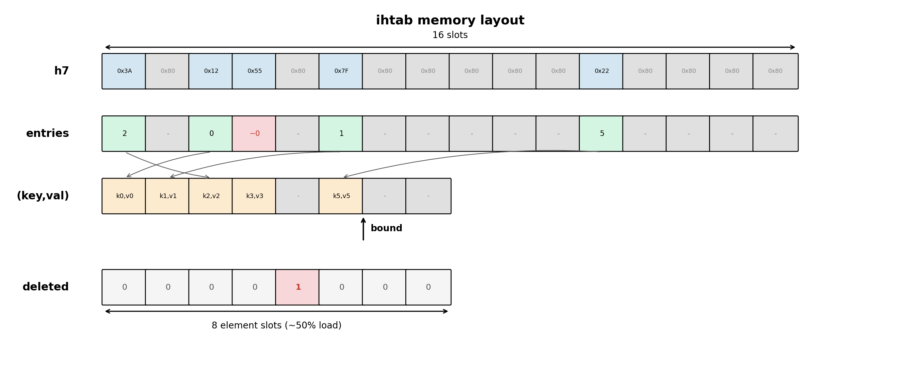
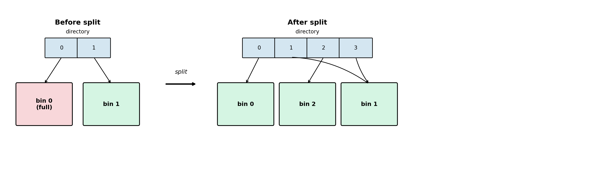
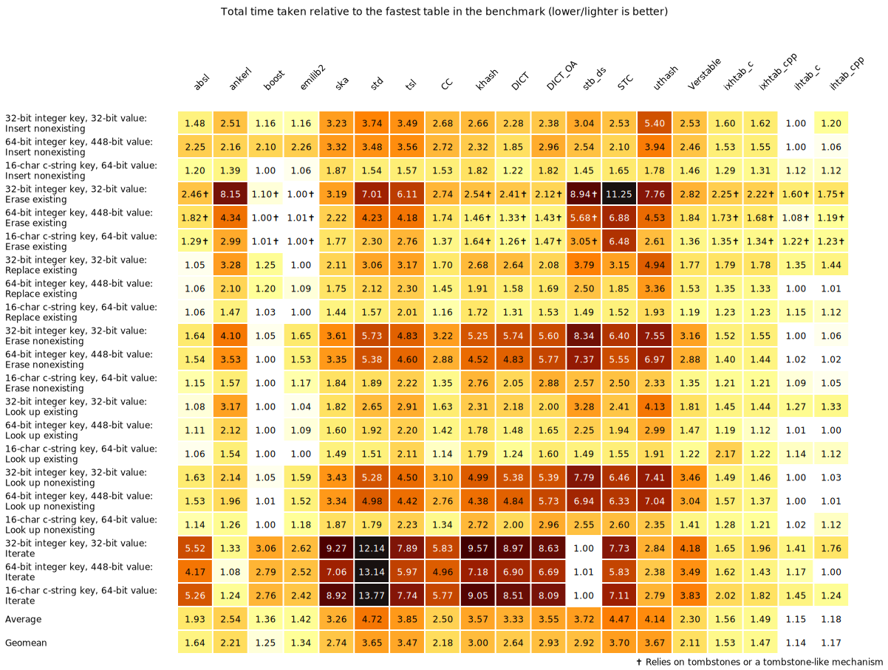
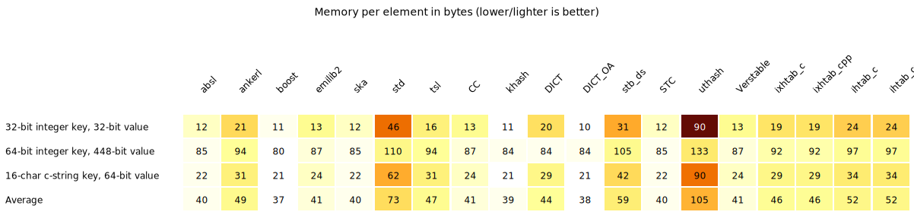

# Two Indexed Hash Tables

My career path has been mostly about programming languages and compiler implementation.  Most high-level languages have built-in hash tables, and compilers and interpreters extensively use hash tables as the most effective search data structure.  So I have a natural interest in hash tables and hashing techniques.

In recent years, direct open-addressing hash tables with high load factors have gained popularity, using SIMD to probe quickly even when the table is nearly full.  One well-known example of this approach is the Swiss hash table (used in abseil and Boost).

I've never been comfortable with the high load factors and slow iterators that come with direct open addressing.  So I took a different angle: decrease the load factor and separate the probe metadata from the elements entirely, using indices to bridge the two. Here's what came out of it.

## The core idea: indexed probing

Most hash tables store key-value pairs directly in the probe array. When you're looking up a key that isn't there, you walk through occupied slots checking each one -- and at 50% load, roughly half your first probes hit an occupied slot, leading to a branch the CPU can't predict well.

**ihtab** takes a different approach.  It keeps a compact array of 7-bit hash tags (one byte per slot) separate from the actual elements. When probing, you first scan the tag array using SIMD to check 8 slots at once, then only access the element storage when the tag matches. Elements live in a separate array, referenced by 32-bit indices stored alongside the tags.

There is also a small `deleted` bitmap, one bit per element, which records which (key,val) slots have been deleted.  It is used primarily during iteration: we walk the dense element array and skip bits marked as deleted, without touching the h7 or entries arrays at all.

Deleted elements are also marked in the entries array by the value ~0, a marker commonly called a tombstone.  During a search, we skip tombstones and continue probing until we find the key or an empty slot.  An alternative would be to use a dedicated h7 tag value for tombstones, which would let us detect deletions without reading the entries array -- but that adds complexity and slows down the common case when there are no deleted elements.



When keys or values are large enough, a full ihtab actually uses less memory than a full direct open-addressing table.  In direct tables, every slot -- including empty ones -- pays the full `sizeof(key) + sizeof(value)` cost.  In ihtab, empty slots only cost 1 byte (tag) + 4 bytes (index), and elements are stored densely with no wasted space.

New elements are appended at the position indicated by `bound`. Insertions continue until the last slot in the (key,val) array is used.  At that point the table is rebuilt: deleted elements are compacted out of the (key,val) array, and if there is still not enough room, all arrays are doubled in size.  The h7, entries, and index data are recomputed from the surviving elements.

This indirection has a nice side effect: the element array is dense and sequential, which makes iteration cache-friendly.  You just walk the element array and check a deleted bitmap -- no scanning through empty slots.

The load factor math works out well too.  With entries at ~50% occupancy, the expected probe count for random hashes is about 1 + 1/2 + 1/4 + ... = 2 group probes.  Compare that to open addressing at 7/8 load where you're looking at 1 + 7/8 + 49/64 + ... = 8 probes.  The tradeoff: the index array adds memory, though for large key-value types the total can actually be smaller since empty slots don't waste `sizeof(element)` space.

Both tables use linear group probing in case of collisions.  This can lead to index clustering, especially with lower-quality hash functions, but at low load factors it's a smaller problem.  On the other hand, linear probing is better for cache locality, which is critical for hash table performance.

## ixhtab: when rebuild cost matters

Rebuilding a large hash table is rare, but when it happens it takes a lot of time.  Some applications -- server ones in particular -- don't tolerate such delays.  Extendible hash tables are designed to reduce this problem.

**ixhtab** (**i**ndexed e**x**tendible hash table) starts out as a single bin, which is essentially an ihtab with 16-bit indices.  The bin grows normally until its size reaches a threshold (e.g. 2^15 elements).  When the threshold is reached, a split happens:

1. Two new bins are created from the original one.  Elements are distributed between them based on a 1-bit portion of each key's hash value.
2. A directory array is created.  Each directory entry points to one of the bins, indexed by that same hash bit.

On subsequent splits, only the full bin is split -- the other bins are untouched.  If the split requires more directory entries than exist, the directory is doubled in size: the new half is initialized as copies of the old entries (so multiple directory slots can point to the same bin).



The practical upside: rebuilds only touch one bin at a time, not the entire table.  The 16-bit indices also cut index memory in half
compared to ihtab's 32-bit ones.  The downside is the directory lookup on every operation and slightly more complex code paths.

## Hash tags: why 7 bits matter

Each slot stores an 8-bit tag.  Seven bits hold a portion of the original hash; the eighth bit (bit 7) marks whether the slot is empty. Valid tags have bit 7 clear (0x00-0x7F), empty slots use 0x80, and deleted slots use 0xFE.

For random hashes, a 7-bit tag reduces the probability of a false positive by a factor of 128.  That is, when the tag matches during a probe, there is only a 1-in-128 chance it's a spurious match rather than the actual key.  This means the expensive key comparison -- which may involve following a pointer, comparing a long string, or touching a separate cache line -- is almost never performed unnecessarily.  At 50% load with 8-slot groups, the expected number of false key comparisons per lookup is roughly 0.03.

## SIMD and SWAR

Both tables probe 8 hash tags at once.  On x86, this is `_mm_cmpeq_epi8` + `_mm_movemask_epi8` -- compare 8 bytes and extract a bitmask in two instructions.  On ARM, NEON intrinsics do the equivalent.  On everything else, a SWAR fallback uses `uint64_t` bit tricks to detect matching bytes without any platform-specific intrinsics.

SIMD searching avoids branch mispredictions, which carry a heavy penalty on modern CPUs (~15-20 cycles per misprediction on current x86).  Without SIMD, probing at 50% load means a per-slot "is this occupied?" branch that is essentially a coin flip -- the worst case for branch prediction.  SIMD replaces all those unpredictable per-slot branches with a single highly-predictable branch ("any match in these 8 slots?"), which almost always resolves correctly.

Empty detection is even cheaper: since empty slots have bit 7 set (0x80) and valid tags don't, `_mm_movemask_epi8(group)` extracts the empty mask with zero comparisons -- just one instruction.

## Usage

Both are header-only.  C++ versions use templates (`ihtab.hpp`, `ixhtab.hpp`) inside namespaces `iht` and `ixht` respectively; C versions use a macro to stamp out typed definitions (`ihtab.h`, `ixhtab.h`).

### C++

```cpp
#include "ihtab.hpp"
using namespace iht;

struct Entry { uint32_t key; uint32_t value; };

struct MyHash {
  size_t operator()(const Entry &e) const {
    return e.key * 0x9E3779B97F4A7C15ULL;
  }
};

struct MyEq {
  bool operator()(const Entry &a, const Entry &b) const {
    return a.key == b.key;
  }
};

using Table = ihtab<Entry, MyHash, MyEq>;

Table t(1024);  // min capacity hint; default is 8

// Insert
Entry e{42, 100};
Entry *res;
if (!t.perform(e, INSERT, &res))
  *res = e;  // write element on new insert

// Replace (insert or update)
Entry e2{42, 200};
t.perform(e2, REPLACE, &res);
*res = e2;  // always write -- inserts if new, overwrites if exists

// Find
Entry query{42, 0};
if (t.perform(query, FIND, &res))
  printf("found: %u\n", res->value);

// Delete
t.perform(query, DELETE, &res);

// Query
printf("count=%lu size=%lu\n", t.els_count(), t.size());

// Iterate (range-based for, uses C++ forward iterator)
for (auto &e : t)
  printf("%u -> %u\n", e.key, e.value);

// Explicit C++ forward iterator
for (auto it = t.begin(); it != t.end(); ++it)
  printf("%u -> %u\n", it->key, it->value);

// Lightweight iter -- no table pointer, just an element
// index and a cached element pointer
auto it = t.iter_begin();
while (Table::iter_valid(it)) {
  printf("%u -> %u\n", it.ptr->key, it.ptr->value);
  t.iter_next(it);
}

// t destroyed automatically at end of scope
```

ixhtab has the same interface in namespace `ixht` -- just swap the prefix:

```cpp
#include "ixhtab.hpp"
using namespace ixht;

using Table = ixhtab<Entry, MyHash, MyEq>;
// INSERT, REPLACE, FIND, DELETE
```

ixhtab also provides a lightweight `iter` (bin index, element index, and cached pointer) with the same `iter_begin`/`iter_valid`/`iter_next` interface.

### C

Include the header and invoke `DEFINE_IHT(El, Hash, Eq)` to generate type-specific structs and functions with an `_El` suffix.  `Hash` and `Eq` are ordinary function names.

```c
#include "ihtab.h"

typedef struct { uint32_t key; uint32_t value; } entry;

static inline iht_hash_t entry_hash(entry e) {
  return e.key * 0x9E3779B97F4A7C15ULL;
}
static inline bool entry_eq(entry a, entry b) {
  return a.key == b.key;
}

DEFINE_IHT(entry, entry_hash, entry_eq)

struct iht_entry t;
iht_create_entry(&t, 1024);

// Insert
entry e = {42, 100};
entry *res;
if (!iht_perform_entry(&t, &e, IHT_INSERT, &res))
  *res = e;

// Replace (insert or update)
entry e2 = {42, 200};
iht_perform_entry(&t, &e2, IHT_REPLACE, &res);
*res = e2;  // always write -- inserts if new, overwrites if exists

// Find
entry query = {42, 0};
if (iht_perform_entry(&t, &query, IHT_FIND, &res))
  printf("found: %u\n", res->value);

// Delete
iht_perform_entry(&t, &query, IHT_DELETE, &res);

// Query
printf("count=%lu size=%lu\n", iht_els_count_entry(&t), iht_size_entry(&t));

// Iterate -- iht_iter_entry is a lightweight iterator
// (just an element index and a cached pointer)
struct iht_iter_entry it = iht_iter_begin_entry(&t);
while (iht_iter_valid_entry(&it)) {
  printf("%u -> %u\n", it.ptr->key, it.ptr->value);
  iht_iter_next_entry(&t, &it);
}

iht_destroy_entry(&t);
```

For ixhtab, replace `iht` / `IHT_*` / `DEFINE_IHT` with `ixht` / `IXHT_*` / `DEFINE_IXHT`.  Note: ixhtab provides `ixht_els_count` but has no `size` equivalent.  The `ixht_iter` iterator carries a bin index in addition to the element index and pointer, but is still lightweight.

## Benchmarking

I wrote benchmarks and a script to compare the performance of abseil's `flat_hash_map` (a well-known direct open-addressing hash table) with ihtab and ixhtab.  All three use [vmum](https://github.com/vnmakarov/mum-hash), a high-performance, high-quality hash function.  The benchmarked tables have 100 (small), 10,000 (medium), and 1,000,000 (large) elements, with both integer and string key types as well as small and large value types.  Here are the results:


As you can see, ihtab works better than abseil for practically all benchmarks.  The bigger the table, the better ihtab's results -- which most probably shows that using compact h7 tags and indices with a low load factor improves cache locality compared to direct open addressing.  The ixhtab results show that extendible hash tables decrease throughput considerably, although they reduce worst-case delays caused by full-table rebuilds.

People could critique my choice of benchmarks -- it always happens. Benchmarks are evil, but the absence of benchmarks is more evil. Therefore I also include results from a hash table benchmark suite written by another person: [c_cpp_hash_tables_benchmark](https://github.com/JacksonAllan/c_cpp_hash_tables_benchmark). I made a [copy of the repository](https://github.com/vnmakarov/c_cpp_hash_tables_benchmark) and added ihtab and ixhtab for benchmarking.  Here are the results for AMD 9900X (you can also find results for Intel 270K+ and Apple M4 in the [repo](https://github.com/vnmakarov/c_cpp_hash_tables_benchmark)):





## When to use which

- **ihtab**: general purpose, fast iteration, good for large tables where you need predictable lookup performance
- **ixhtab**: when you have many elements and want to avoid expensive full-table rebuilds, or when memory matters (16-bit indices)
- Both beat `std::unordered_map` handily and are competitive with boost/abseil flat hash maps on most workloads

Designing a hash table that works best for all use scenarios is probably impossible -- the right design depends on your data, your access patterns, and your key/value sizes.  But I hope ihtab and ixhtab would be good candidates for your choice.
