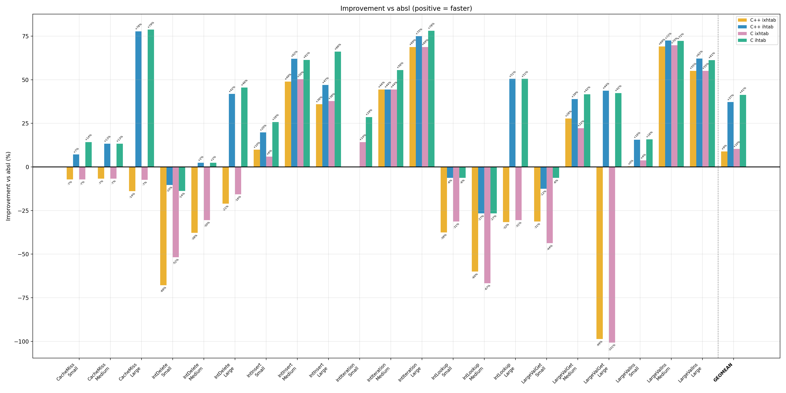

# Two Indexed Hash Tables

My career path has been mostly about programming languages and compiler implementation.  Most high-level languages have built-in hash tables, and compilers and interpreters extensively use hash tables as the most effective search data structure.  So I have a natural interest in hash tables and hashing techniques.

In recent years, the Swiss table design has become popular.  Swiss tables are **direct** [open-addressing hash tables](https://en.wikipedia.org/wiki/Open_addressing) with mainly linear probing.  They use [SIMD](https://en.wikipedia.org/wiki/Single_instruction,_multiple_data) to probe quickly even when the table is nearly full and a very high load factor (87.5%) to save memory used by **direct** addressing tables.  Well-known implementations include [abseil](https://abseil.io/about/design/swisstables) and [Boost](https://www.boost.org/doc/libs/1_85_0/libs/unordered/doc/html/unordered.html).

Open-addressing hash tables with linear probing were first described in a 1958 [publication](https://www.mathnet.ru/rus/dan28010) by the famous Russian academician A. Ershov.  In the publication, Ershov (he was a director of a postgraduate school where I studied) gave an empirical estimation based on the Monte Carlo method of the average number of probes for 50% load.  Later, average probe counts for open-addressing tables with linear probing depending on the table load were obtained for a simplified model of the table.  You can find them in Knuth's book "The Art of Computer Programming", volume 3.  For load 87.5%, successful and unsuccessful search require correspondingly about 4 and 32 probes on average.

I've never been comfortable with the high load factors and slow iterators that come with direct open addressing.  So I took a different angle: decrease the load factor and separate the probe metadata from the elements entirely, using indices to bridge the two. Here's what came out of it.  Spoiler: geomean performance of the resulting **indexed** open-addressing table on different benchmarks is better than the one of the best **direct** open-addressing tables.

## The core design ideas

Many hash tables store key-value pairs directly in the probe array.  This has two performance problems on modern CPUs:

- **Poor cache locality.**  Probing touches full key-value slots.  This wastes cache lines when keys or values are large.  We could keep pointers to key-value pairs in the table instead of the pairs themselves to decrease size of unused slots but essentially this turns the table into an indexed one.  Iteration is even worse.  You walk every slot in the array, skipping empty ones.  That is especially wasteful when the table is sparse or the elements are large.

- **Branch misprediction.**  At 50% load, roughly half the probes hit an occupied slot when searching for a key not existing in the table.  The branch on empty/busy slot becomes a coin flip, which is the worst case for branch prediction.  Each misprediction costs ~15-20 cycles on current x86.

I wanted to improve both.

**ihtab** separates probe metadata from element storage entirely:

- There is a compact array of **7-bit hash tags** (one byte per tag slot). It is probed by using SIMD, which checks 8 sequential 7-bit tags at once.  This replaces many unpredictable per-slot branches with a single group comparison and branch, which considerably decreases misprediction.  The 7-bit tags also reduce the probability of checking index (see below) to 1/128 when the index references a different table element.

- The actual elements live in a **separate array**.  They are referenced by 32-bit indices stored in another separate array alongside the tags.  Probing only touches the small tag and index arrays.  Cache lines aren't wasted on key-value data until a tag match confirms the slot is worth examining.

- There is also a small bitmap (one bit per element) recording which elements have been deleted.  Iteration walks the dense element array and checks the bitmap.  No scanning through empty tag slots, no touching the tag or index arrays at all.

Deleted elements are also marked in the index array with a tombstone value (~0).  They are skipped during searching.  An alternative would be to reserve a dedicated tag value for tombstones, detecting deletions without reading the index array.  But that adds complexity and slows down the common case when there are no deleted elements.


**Memory usage.**  When keys or values are large, ihtab can actually use *less* memory than a direct open-addressing table.  In direct addressing tables, there are always empty element slots whose memory is wasted.  In ihtab, empty tag and index slots take only 5 bytes.  Elements themselves are stored densely in the element array with no wasted space.

**Table growth.**  New elements are appended at the position indicated by `bound`.  Insertions continue until the element array is full.  At that point the table rebuilds.  Deleted elements are removed from the element array.  And if there is still not enough room for a new element, all arrays are doubled in size.  The tag, index, and bitmap data are recomputed from the surviving elements.

**Table load factor.**  The tag and index arrays have at most 50% occupancy (occupancy here is a percent of the array elements corresponding to elements actually in the table).  A simple estimated probe count of finding non-empty slot is 1 + 1/2 + 1/4 + ... = 2 group probes.  Compare that with 1 + 7/8 + 49/64 + ... = 8 probes for open addressing at 7/8 load, which is typical for **direct** addressing tables.

**Collision handling.**  Both tables use linear group probing.  This can lead to clustering with lower-quality hash functions, but at 50% load the effect is small.  But more important is that linear probing improves data cache locality and hash table performance as a result.

## ixhtab: when rebuild cost matters

Rebuilding a large hash table is rare, but when it happens it takes a lot of time.  Some applications, server ones in particular, cannot tolerate such delays.  Extendible hash tables are designed to reduce this problem.

**ixhtab** (**i**ndexed e**x**tendible hash table) starts out as a single bin. A bin is essentially an ihtab with 16-bit indices.  The bin grows as in ihtab until its size reaches a threshold (e.g. 2^15 elements).  Then a split happens:

1. Two new bins are created from the original one.  Elements are distributed between them based on a 1-bit portion of each key's hash value.
2. A directory array is created.  Each directory entry points to one of the bins, indexed by that same hash bit.

On subsequent splits, only the full bin is split.  The other bins are untouched.  If the split requires more directory indexes than exist, the directory is doubled in size.  The new half is initialized as copies of the old indexes, so multiple directory slots can point to the same bin.


The upside is that rebuilds only touch one bin at a time, not the entire table.  The 16-bit indices also cut index memory in half compared to ihtab's 32-bit ones.  The downside is the directory lookup on every operation and slightly more complex code paths.

## Hash tags: why 7 bits matter

Each tag slot stores an 8-bit value.  Seven bits hold a portion of the original hash.  The eighth bit (bit 7) marks whether the slot is empty.  Valid tags have bit 7 clear (0x00-0x7F), empty tag slots use 0x80, and deleted tag slots use 0xFE.

For uniformly random hashes, a 7-bit tag reduces the probability of a false positive by a factor of 128.  When the tag matches during a probe, there is only a 1-in-128 chance it is a spurious match rather than the actual key.  So the expensive key comparison, which may involve following a pointer, comparing a long string, or touching a separate cache line, is almost never performed unnecessarily.  At 50% load with a group of eight 7-bit tags, the expected number of false key comparisons per unsuccessful lookup is roughly 1/32.

## SIMD and SWAR

Both tables probe 8 hash tags at once.  On x86 `_mm_cmpeq_epi8` and `_mm_movemask_epi8` are used to compare 8 bytes and extract a bitmask.  On ARM, analogous NEON intrinsics are used.  On other targets, a [SWAR](https://en.wikipedia.org/wiki/Single_instruction,_multiple_data) fallback is used to detect matching bytes without any target-specific intrinsics.

SIMD searching avoids branch mispredictions to decrease their penalty (~15-20 cycles per misprediction on current x86 CPUs).  Without SIMD, probing at 50% load would mean 50% probability that branch on empty or occupied slot is taken. This is the worst case for CPU branch predictor.  SIMD replaces several unpredictable per-slot branches with a single highly-predictable branch on matching with 8 slots at once.

Empty detection is even cheaper.  We need only one instruction `_mm_movemask_epi8(group)` as empty tag has value 0x80 and non-empty tags have always 0 in the 7th bit.

## Usage

Both are header-only C++ templates:

```cpp
#include "ihtab.h"

struct Entry { uint32_t key; uint32_t value; };

struct MyHash {
  size_t operator()(const Entry &e) const {
    return e.key * 0x9E3779B97F4A7C15ULL;
  }
};

struct MyEq {
  bool operator()(const Entry &a, const Entry &b) const {
    return a.key == b.key;
  }
};

using Table = ihtab_t<Entry, MyHash, MyEq>;

Table t;
Table::create(&t, 1024);  // min capacity hint

// Insert
Entry e{42, 100};
Entry *res;
if (!Table::do_(&t, e, IHTAB_INSERT, &res))
  *res = e;  // write element on new insert

// Find
Entry query{42, 0};
if (Table::do_(&t, query, IHTAB_FIND, &res))
  printf("found: %u\n", res->value);

// Delete
Table::do_(&t, query, IHTAB_DELETE, &res);

// Iterate
auto it = Table::iter_begin(&t);
while (Table::iter_valid(it)) {
  printf("%u -> %u\n", it.ptr->key, it.ptr->value);
  Table::iter_next(&t, it);
}

Table::destroy(&t);
```

ixhtab has the same interface, just swap the prefix:

```cpp
using Table = ixhtab_t<Entry, MyHash, MyEq>;
// IXHTAB_INSERT, IXHTAB_FIND, IXHTAB_DELETE
```

## Benchmarking

I wrote benchmarks and a script to compare the performance of abseil's `flat_hash_map`, a well-known direct open-addressing hash table, with ihtab and ixhtab.  All three use [vmum](https://github.com/vnmakarov/mum-hash), a high-performance, high-quality hash function.  The benchmarked tables have 100 (small), 10,000 (medium), and 1,000,000 (large) elements.  I used 64-bit integer keys and values of size 4 bytes and about 100 bytes. Here are the results on AMD9900X:



The results of ixhtab show that extendible hash tables decrease throughput considerably.  That is a payment for reducing worst-case delays caused by full-table rebuilds.

ihtab works better than abseil for practically all benchmarks.  The bigger the table, the better ihtab's results.  I believe this is a result of better branch prediction and better cache locality when using compact h7 tags and indices with a low load factor.  To confirm this, here are statistics obtained by perf for 10M IntLookup in a table with 1M elements on AMD9900X:

| Metric                | absl         | ihtab        | Advantage            |
|-----------------------|--------------|--------------|----------------------|
| Cycles                | 641.7M       | 466.4M       | **ihtab** 27% fewer  |
| Instructions          | 493.3M       | 513.9M       | **absl** 4% fewer    |
| IPC                   | 0.77         | 1.10         | **ihtab** 43% higher |
| L1-dcache miss rate   | 20.7%        | 17.1%        | **ihtab** 17% lower  |
| Branch misses         | 913K (1.83%) | 338K (0.59%) | **ihtab** 63% fewer  |
| dTLB miss rate        | 28.7%        | 7.0%         | **ihtab** 4.1x lower |


People could critique my choice of benchmarks, and it always happens.  Therefore I also include results from a hash table benchmark suite written independently by another person: [c_cpp_hash_tables_benchmark](https://github.com/JacksonAllan/c_cpp_hash_tables_benchmark).  I made a [copy of the repository](https://github.com/vnmakarov/c_cpp_hash_tables_benchmark) and added ihtab and ixhtab for benchmarking.  Here are the results:


## When to use which

**ihtab** is a general-purpose table with fast iteration, good for large tables where you need predictable lookup performance.  Use **ixhtab** only when you want to avoid expensive full-table rebuilds.  ixhtab also can be used when you need to save memory as it uses 16-bit indices.  The both tables are much better than C++ `std::unordered_map`.  They are also competitive with boost/abseil flat hash maps on most workloads.

## Conclusion

Designing the hash tables I've tried more than ten variants of indexed hash tables (some of them can be found in history of [repository](https://github.com/vnmakarov/c_cpp_hash_tables_benchmark)).  The variants had different conflict resolution, hash tag usage, and table data placement.  I found that designing a hash table that works best for all use scenarios is probably impossible.  The right design depends on your data, your access patterns, and your key/value sizes.  But I hope ihtab and ixhtab would be good candidates for your choice.
You can find ihtab and ixhtab on [github](https://github.com/vnmakarov/ihtab).

So what is next?  I'd like to try the ihtab design in a widely used programming language.  I think the Go map implementation would be a good candidate for this.